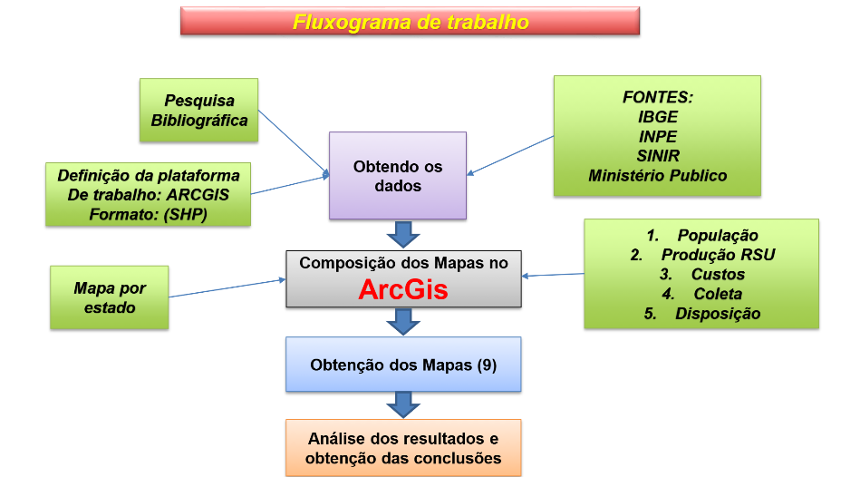

# Study of the Territorial Distribution and Management of Urban Solid Waste (USW) in Rio de Janeiro with a Focus on Sustainable Technology Integration

Develop a comprehensive analysis of the territorial distribution of urban solid waste (USW) disposal in Rio de Janeiro, identifying patterns, challenges, and gaps in the current management system. The study will address global parameters of efficiency, sustainability, and governance, evaluating the effectiveness of waste collection, transportation, treatment, and final disposal systems.

# Introduction 
Solid waste management involves collecting and processing
garbage. It also recycles products. Solid waste management helps determine
the best ways to use industrialised garbage. Industrialization produces
chemicals and other waste products that harm human health. Solid waste
management reduces this impact. Waste management has several ways. This
study examined Rio de Janeiro district in Brazil. This study shows how GIS may be utilised for waste
management planning. The result shows the solid waste management area.
So, garbage management should be simplified.

# Work Methodology

These variables were selected in the study as key indicators of urban solid waste management due to their ability to reflect various critical aspects of waste handling and sustainability in municipalities. These variables enable the analysis of not only population distribution and its impact on waste generation but also the evaluation of access to essential services such as direct collection and the costs associated with waste management. Furthermore, the classification of types of final waste disposal provides insight into the practices employed and their alignment with sustainability principles. Together, these indicators offer a comprehensive perspective that facilitates the identification of strengths, weaknesses, and opportunities to improve waste management at the municipal level.

1. **Distribution of Total Population by Municipality**: Geographic representation of the total number of inhabitants in each municipality of the study area, highlighting population densities and concentration zones.  

2. **Percentage of Urban Population by Municipality**: Geographic representation showing the proportion of inhabitants living in urban areas relative to the total population in each municipality.  

3. **Per Capita Production of Urban Solid Waste (USW)**: Geographic representation of the average amount of USW generated per person in each municipality, identifying patterns of consumption and waste generation.  

4. **Total Production of USW by Municipality**: Geographic representation illustrating the total amount of USW generated in each municipality, useful for identifying areas with the highest waste volumes.  

5. **Annual Per Capita Cost of USW Management**: Geographic representation of the average annual costs per inhabitant related to waste management in each municipality.  

6. **Direct Collection Coverage Rate of USW**: Geographic representation showing the percentage of households or areas served by direct waste collection services, highlighting gaps in coverage.  

7. **Types of Final Urban Solid Waste Disposal**: Geographic representation classifying municipalities based on the primary type of waste disposal (landfill, open dump, recycling, among others).  

The methodology proposed in the study is described in detail along the path shown in figure Nº1. This figure clearly and systematically illustrates the key steps and processes that make up the urban solid waste management approach, from data collection to the analysis and interpretation of results. Through this visual representation, the comprehensive approach adopted to evaluate the selected indicators is made easier to understand, allowing for a better comprehension of the procedures and interactions between the different elements of the study.

<figure style="text-align: center;">
  
  <figcaption>Figura 1: Este es el nombre o título de la imagen.</figcaption>
</figure>

